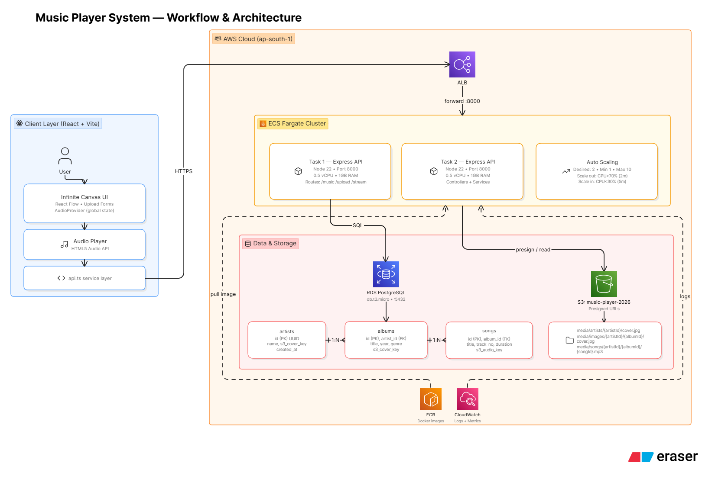
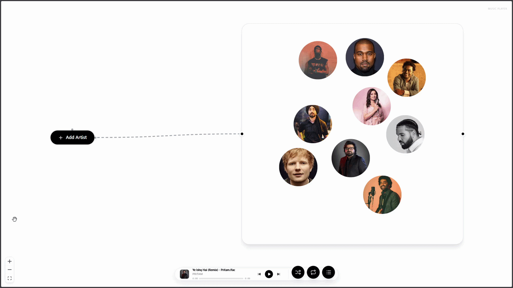
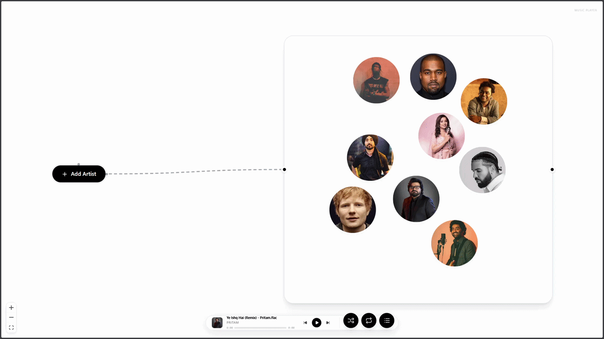
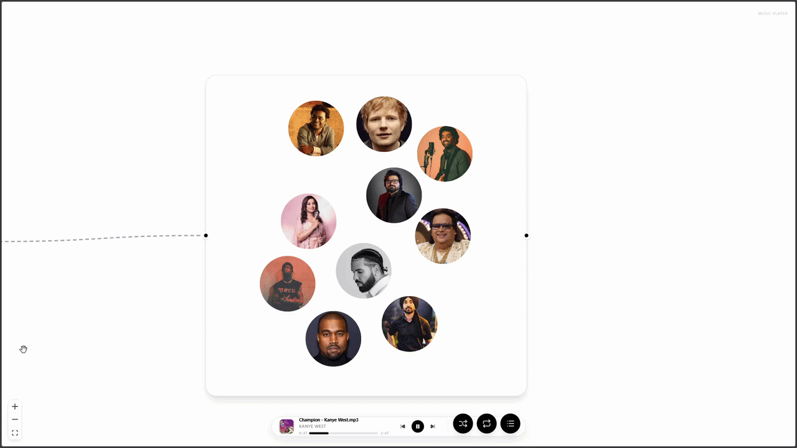
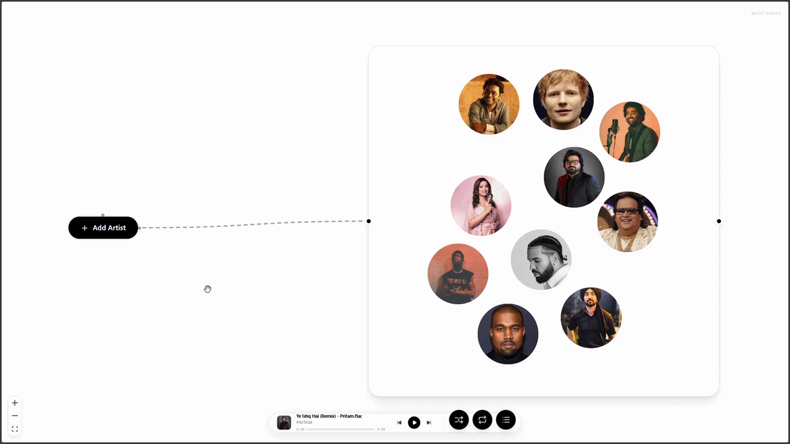
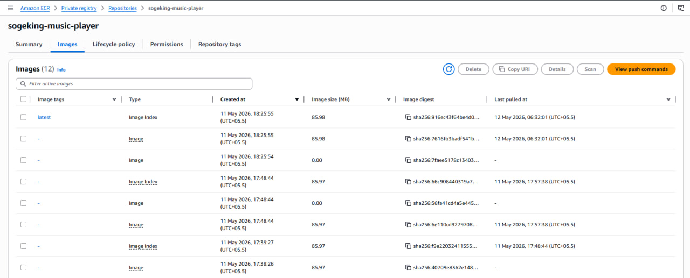
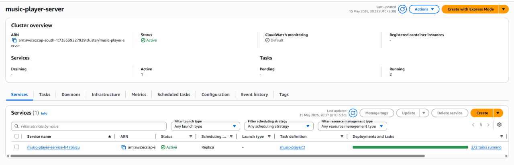
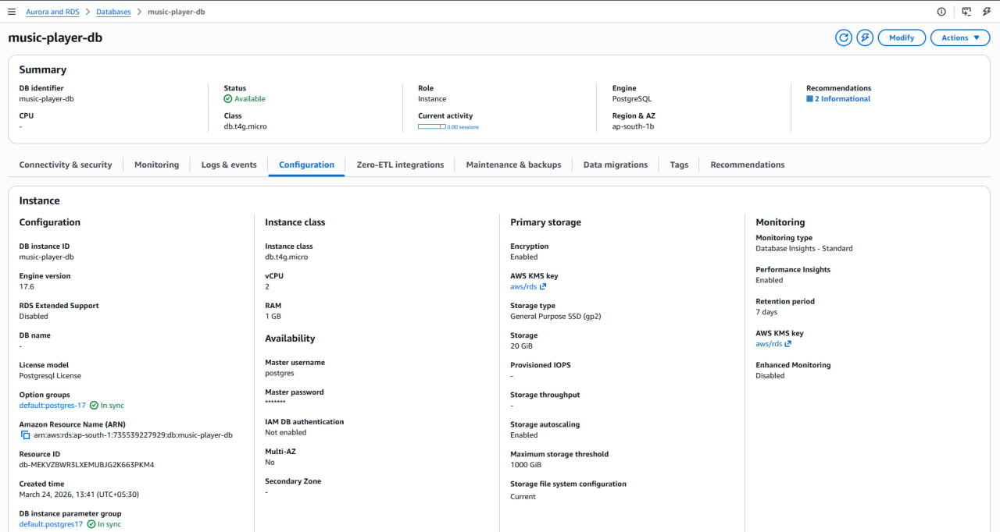
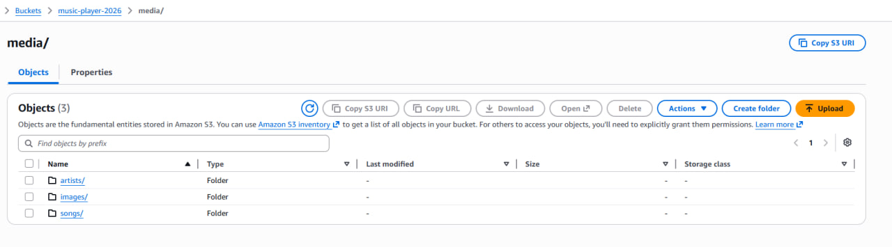
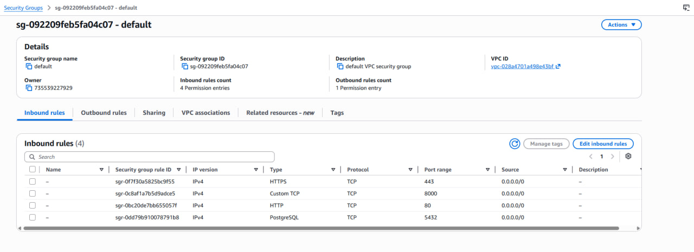

# 🎵 Cloud-Native Music Streaming Platform

A scalable, production-ready music streaming application built with **React**, **Node.js**, **TypeScript**, and **AWS**. Features artist/album management, direct-to-S3 uploads, and an innovative infinite canvas UI.

> **Note**: The live deployment has been taken offline to avoid AWS costs after the free tier period ended. Please refer to the demo video and infrastructure screenshots below for a complete walkthrough.

### 🔗 Deployment Evidence

This project was fully deployed on AWS infrastructure. Below are the public endpoints and identifiers:

- **Application Load Balancer**: `music-player-load-balancer-19704141.ap-south-1.elb.amazonaws.com`
- **RDS PostgreSQL Endpoint**: `music-player-db.cbs4e4gim1z4.ap-south-1.rds.amazonaws.com:5432`
- **S3 Bucket**: `music-player-2026` (Region: `ap-south-1`)
- **S3 Public URL**: `https://music-player-2026.s3.ap-south-1.amazonaws.com`
- **AWS Region**: `ap-south-1` (Mumbai)
- **ECS Cluster**: `music-player-cluster`

---

## 🎥 Demo Video

**[▶️ Click to Watch Full Demo](https://youtu.be/gtqFSc32qnM)**

---

## 🏗️ System Architecture

  

**Architecture Highlights**:
- **Frontend**: React + TypeScript + Vite with infinite canvas UI (React Flow)
- **Backend**: Express.js REST API running on ECS Fargate (serverless containers)
- **Database**: AWS RDS PostgreSQL for metadata storage
- **Storage**: AWS S3 for audio files and images
- **Load Balancing**: Application Load Balancer with auto-scaling
- **Deployment**: Docker containers orchestrated by ECS with zero-downtime rolling updates

---

## ✨ Key Features

### 1. Infinite Canvas UI

  

Interactive node-based interface with smooth panning and zooming. Minimalist black & white design with immutable nodes.

---

### 2. Artist Management

  

Upload artist profiles with cover images. Direct client-to-S3 uploads using presigned URLs for scalability.

---

### 3. Artist Discography

  

View complete artist discography with albums, tracks, and metadata. Efficient database queries with JOIN operations.

---

### 4. Album & Track Upload

  

3-step wizard for creating albums: Album Info → Add Tracks → Review. Auto-detects audio duration and handles batch uploads to S3.

---

## ☁️ AWS Infrastructure

### Container Registry & Deployment

  

Docker images stored in AWS ECR with automated deployments to ECS Fargate.

---

### ECS Fargate Service

  

Serverless container orchestration with auto-scaling (0.5 vCPU, 1 GB per task). Rolling updates for zero downtime.

---

### RDS PostgreSQL Database

  

Managed PostgreSQL (db.t3.micro) with automated backups and SSL/TLS encryption.

---

### S3 Storage

  

Object storage for audio files and images with presigned URLs for secure, time-limited access.

---

### VPC & Security

  

Network isolation with security groups. ALB in public subnet, ECS/RDS in private subnets.

---

## 🛠️ Tech Stack

**Frontend**:
- React 18 + TypeScript + Vite
- React Flow (infinite canvas)
- Tailwind CSS v4
- Axios

**Backend**:
- Node.js 22 + Express
- TypeScript
- PostgreSQL (pg driver)
- AWS SDK v3

**AWS Services**:
- ECS Fargate (compute)
- Application Load Balancer
- RDS PostgreSQL (database)
- S3 (storage)
- ECR (container registry)
- VPC & Security Groups

**DevOps**:
- Docker
- AWS ECS orchestration
- CloudWatch monitoring

---

**Built with ❤️ using React, Node.js, TypeScript, and AWS**
